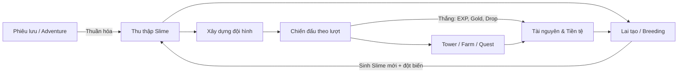
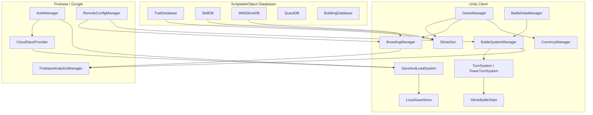
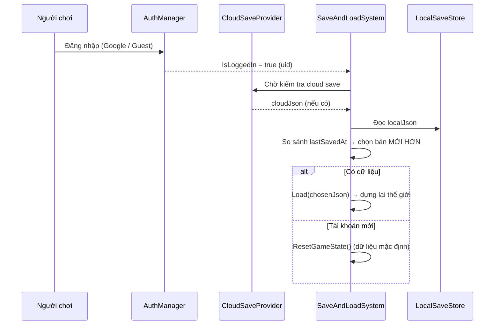

<div align="center">

# 🌊 GOO GRIMOIRE

### Game nhập vai lai tạo, thu thập và chiến đấu theo lượt với sinh vật Slime

*Đồ án Tốt nghiệp (DATN)*


> *"Ký ức là điều duy nhất không bao giờ biến mất."*

</div>

---

## 📑 Mục lục

1. [Tóm tắt đề tài](#1-tóm-tắt-đề-tài)
2. [Mục tiêu & phạm vi](#2-mục-tiêu--phạm-vi)
3. [Đối tượng người dùng](#3-đối-tượng-người-dùng)
4. [Bối cảnh & cốt truyện](#4-bối-cảnh--cốt-truyện)
5. [Đặc tả chức năng](#5-đặc-tả-chức-năng)
6. [Yêu cầu phi chức năng](#6-yêu-cầu-phi-chức-năng)
7. [Cơ chế gameplay](#7-cơ-chế-gameplay)
8. [Hệ thống cân bằng game](#8-hệ-thống-cân-bằng-game)
9. [Công nghệ sử dụng](#9-công-nghệ-sử-dụng)
10. [Kiến trúc hệ thống](#10-kiến-trúc-hệ-thống)
11. [Mô hình dữ liệu & lưu trữ](#11-mô-hình-dữ-liệu--lưu-trữ)
12. [Cấu trúc thư mục](#12-cấu-trúc-thư-mục)
13. [Hướng dẫn cài đặt & build](#13-hướng-dẫn-cài-đặt--build)
14. [Kiểm thử](#14-kiểm-thử)
15. [Kết quả đạt được](#15-kết-quả-đạt-được)
16. [Hướng phát triển](#16-hướng-phát-triển)
17. [Nhóm thực hiện](#17-nhóm-thực-hiện)
18. [Tài liệu tham khảo](#18-tài-liệu-tham-khảo)

---

## 1. Tóm tắt đề tài

**Goo Grimoire** là một tựa game nhập vai (RPG) trên nền tảng di động, được phát triển bằng **Unity Engine**. Trò chơi xoay quanh ba trụ cột gameplay có liên kết chặt chẽ:

- **Lai tạo (Breeding)** — phối ghép Slime để tạo ra thế hệ mới với đặc tính kế thừa và khả năng đột biến.
- **Thu thập & Phiêu lưu (Collection & Adventure)** — khám phá thế giới, thuần hóa và ghi nhớ Slime hoang.
- **Chiến đấu theo lượt (Turn-based Combat)** — xây dựng đội hình và giao chiến chiến thuật; đây là **trọng tâm** của toàn bộ trải nghiệm.

Điểm nhấn thiết kế là hệ thống **Slime cấu thành từ 3 bộ phận độc lập** (Vũ khí – Thân – Đầu), cho phép tổ hợp số lượng lớn biến thể về chỉ số và kỹ năng. Kết hợp với cơ chế đột biến khi lai tạo, người chơi được khuyến khích sưu tầm, sáng tạo và không ngừng tối ưu đội hình của mình.

Về mặt kỹ thuật, dự án tổ chức theo module, sử dụng **animation Spine 2D**, và tích hợp **Firebase** (Authentication, Remote Config, Analytics, Cloud Save) cùng **Google Sign-In** để hỗ trợ đăng nhập và đồng bộ dữ liệu đám mây.

---

## 2. Mục tiêu & phạm vi

### 2.1. Mục tiêu

- Xây dựng một sản phẩm game hoàn chỉnh, có thể chơi được từ đầu đến cuối, tích hợp đủ ba vòng lặp gameplay (lai tạo – thu thập – chiến đấu).
- Thiết kế và cài đặt một **hệ thống chiến đấu theo lượt** có chiều sâu chiến thuật (quản lý tài nguyên ĐCK/Năng lượng, thứ tự lượt theo Action Value, hệ kỹ năng đa dạng).
- Áp dụng **kiến trúc hướng dữ liệu** (Data-Driven) bằng ScriptableObject để dễ dàng mở rộng nội dung (trait, kỹ năng, enemy, quest…).
- Tích hợp **dịch vụ backend** (xác thực người dùng, lưu đám mây, cấu hình từ xa, phân tích hành vi) theo hướng có thể bật/tắt linh hoạt.
- Xây dựng **hệ thống cân bằng game** có cơ sở số liệu rõ ràng, có thể tinh chỉnh mà không cần build lại.

### 2.2. Phạm vi

| Trong phạm vi | Ngoài phạm vi |
|---|---|
| Client game single-player trên Android | Chế độ PvP thời gian thực (online multiplayer) |
| Đăng nhập & Cloud Save qua Firebase | Cửa hàng thanh toán thật (IAP) |
| Nội dung cốt truyện, tháp, farm, quest | Vận hành thương mại / Live-ops dài hạn |
| Cân bằng số liệu theo tài liệu thiết kế | Địa phương hóa đa ngôn ngữ đầy đủ |

---

## 3. Đối tượng người dùng

- **Người chơi casual–midcore** yêu thích thể loại *creature collector* (Pokémon-like, monster-taming) và game chiến thuật theo lượt.
- Người chơi thích yếu tố **sưu tầm, tối ưu chỉ số và xây dựng đội hình (theorycrafting)**.
- Độ tuổi hướng tới: phổ thông, giao diện thân thiện, có tutorial dẫn dắt gắn liền cốt truyện.

---

## 4. Bối cảnh & cốt truyện

### 4.1. Thế giới — Lumis Isle

**Lumis Isle** là một quần đảo huyền bí hình thành hoàn toàn từ **Goo** — một dạng vật chất sống lưu giữ ký ức và cảm xúc.

**✦ Luật của Goo ✦**
- Mọi Slime đều sinh ra từ Goo và tồn tại nhờ Goo.
- Khi một Slime biến mất, "dữ liệu gen" của nó phải được ghi lại — nếu không, nó bị **xóa sổ vĩnh viễn**.
- Thứ lưu giữ dữ liệu gen là **Grimoire** — một sinh vật Goo cổ đại đội lốt cuốn sách.
- Người được Grimoire chọn để ghi nhớ Slime được gọi là **Keeper**.

**Triết lý cốt lõi:** Người chơi *không tiêu diệt* Slime mà *ghi nhớ* chúng. Kẻ thù (**Corrupted Slime**) là những Slime đã mất ký ức vì Goo bị ô nhiễm (*Goo Corruption*).

### 4.2. Tuyến truyện

| Act | Tiêu đề | Nội dung cốt lõi |
|---|---|---|
| **0** | *The White Storm* | Bão Goo xóa trắng mọi Grimoire; Lira bất đắc dĩ thành Keeper. |
| **1** | *The First Page* | Học thuần hóa & chiến đấu; thấm triết lý *"Keeper không giết — Keeper ghi nhớ"*. |
| **2** | *Mutation* | Khám phá đột biến bị Viện Goo cấm; lần đầu nghi ngờ người dẫn dắt. |
| **3** | *The Tower of Goo* | Bí mật của Viện, bản chất thật của Grimoire, gặp kẻ thù thật sự. |
| **4** | *Kael* | Antagonist — không phải ác nhân mà là hậu quả của một hệ thống thất bại. |
| **5** | *Lumis is Fading* | Cao trào cảm xúc: Pure Goo trong Lumis hấp thu Corruption để bảo vệ Lira. |

### 4.3. Nhân vật

| Nhân vật | Vai trò | Mô tả |
|---|---|---|
| **Lira Vale** | Nhân vật chính | Thực tập sinh Viện Goo; trưởng thành qua kết nối, không qua sức mạnh. |
| **Lumis** | Slime đồng hành | Slime cuối cùng mang **Pure Goo** — lõi cân bằng của cả hòn đảo. |
| **Professor Vael** | Cố vấn | Giáo sư trưởng Viện Goo, mang gánh nặng một quyết định không thể tha thứ. |
| **Kael** | Đối thủ | Keeper tiền nhiệm, trở lại với ý định xóa sổ hệ thống Goo. |

---

## 5. Đặc tả chức năng

Các chức năng chính (functional requirements) của hệ thống:

| Mã | Chức năng | Mô tả |
|---|---|---|
| **F01** | Xác thực người dùng | Đăng nhập qua Google / ẩn danh (guest); hỗ trợ offline dev mode. |
| **F02** | Lưu & tải dữ liệu | Lưu cục bộ (PlayerPrefs) + Cloud Save; tự chọn bản mới hơn giữa local/cloud. |
| **F03** | Thu thập & thuần hóa | Gặp Slime hoang trong Adventure, thuần hóa bằng mini-game ném Marshmallow đúng nhịp. |
| **F04** | Lai tạo Slime | Chọn 2 Slime, tính chi phí/thời gian, sinh Slime con với xác suất đột biến. |
| **F05** | Quản lý bộ sưu tập | Xem, chọn, sắp xếp Slime; giới hạn số lượng (mặc định 30). |
| **F06** | Xây dựng đội hình | Chọn & sắp xếp đội hình chiến đấu (Formation). |
| **F07** | Chiến đấu theo lượt | Quản lý ĐCK/Năng lượng, thứ tự lượt (AV), thi triển Chiến kỹ/Tuyệt kỹ. |
| **F08** | Vượt ải (Adventure) | Đánh theo chapter với các wave enemy thiết kế sẵn. |
| **F09** | Leo tháp (Tower) | Thử thách tầng tăng dần độ khó, có Boss, lưu tiến độ & nhận thưởng theo tầng. |
| **F10** | Farm tài nguyên | Chế độ farm coin/tài nguyên theo độ khó. |
| **F11** | Nhiệm vụ (Quest) | Đa loại: Battle / Breeding / Collect / Time / Tower quest. |
| **F12** | Thành tựu (Achievement) | Mở khóa & nhận thưởng theo cột mốc. |
| **F13** | Tiền tệ & tài nguyên | Quản lý Coins, Gem, Marshmallow… và giao dịch (breeding, shop). |
| **F14** | Xây dựng công trình | Đặt công trình lên các slot trong khu vực người chơi. |
| **F15** | Cấu hình từ xa | Nhận thông số cân bằng qua Firebase Remote Config. |
| **F16** | Phân tích hành vi | Ghi nhận sự kiện gameplay (breeding, battle…) qua Analytics. |

---

## 6. Yêu cầu phi chức năng

| Nhóm | Yêu cầu |
|---|---|
| **Hiệu năng** | Chạy mượt trên thiết bị Android tầm trung; animation Spine tối ưu cho 2D. |
| **Khả năng mở rộng** | Nội dung khai báo bằng ScriptableObject → thêm trait/kỹ năng/enemy không cần sửa code lõi. |
| **Khả năng bảo trì** | Mã nguồn chia module theo hệ thống; dùng mẫu Singleton cho các Manager. |
| **Khả năng cấu hình** | Thông số cân bằng chỉnh qua Remote Config, không cần build lại. |
| **Tính sẵn sàng** | Hoạt động **offline** với giá trị mặc định khi backend chưa bật. |
| **Toàn vẹn dữ liệu** | Cơ chế kiểm tra toàn vẹn save (`SaveIntegrity`) và migrate save cũ. |
| **Trải nghiệm** | Điều khiển cảm ứng thân thiện: joystick ảo, nút thao tác riêng cho mobile. |

---

## 7. Cơ chế gameplay

### 7.1. Cấu trúc một Slime

Mỗi Slime được cấu thành từ **3 bộ phận** (`TraitInstance`), mỗi bộ phận sinh từ một `TraitSO` (ScriptableObject) và đóng góp chỉ số + kỹ năng khác nhau:

| Bộ phận | Chỉ số chính | Vai trò |
|---|---|---|
| **Weapon** (Vũ khí) | ATK, Magic ATK | Đòn thường & Chiến kỹ / Tuyệt kỹ gây sát thương |
| **Body** (Thân) | HP, DEF, Speed | Máu, giáp, thứ tự hành động + Nội tại (passive) |
| **Head / Armor** (Đầu) | Crit Rate, Crit DMG | Tỷ lệ & hệ số chí mạng + Chiến kỹ hỗ trợ |

> Chỉ số cuối cùng của Slime = **tổng** chỉ số của 3 `TraitInstance` (`Slime.CalculateStats()`).

### 7.2. Vòng lặp gameplay (Core Loop)



### 7.3. Chiến đấu theo lượt — trọng tâm

- **Điểm Chiến Kỹ (ĐCK):** tài nguyên dùng chung của đội (max 5, đầu trận 3). Đòn thường **+1 ĐCK**; Chiến kỹ tốn **1–3 ĐCK**.
- **Tuyệt kỹ (Năng lượng):** thanh riêng của mỗi Slime (0 → 100), nạp qua hành động (+20 đòn thường, +25 chiến kỹ, +10 khi bị đánh); mở khóa từ bậc **Rare**.
- **Thứ tự lượt (Action Value):** `AV ≈ 10000 / Speed` — AV thấp đi trước. Có cơ chế *kéo lượt* (đẩy đồng minh tiến) và *đẩy lùi* (đẩy địch lùi).
- **Đội hình (Formation):** sắp xếp bằng kéo-thả (`FormationManager`, `SlimeDragHandler`).

### 7.4. Các chế độ nội dung

| Chế độ | Mô tả |
|---|---|
| **Adventure** | Đánh theo chapter/màn với các wave enemy thiết kế sẵn. |
| **Tower of Goo** | Leo tháp độ khó tăng dần, có Boss, lưu tiến độ & thưởng từng tầng. |
| **Farm** | Farm coin/tài nguyên theo độ khó đã mở khóa. |
| **Quest** | Nhiệm vụ đa loại tạo mục tiêu ngắn & dài hạn. |
| **Building** | Đặt công trình lên slot khu vực người chơi. |

---

## 8. Hệ thống cân bằng game

> Số liệu trích từ tài liệu thiết kế cân bằng của nhóm. Nhiều thông số chỉnh được qua **Remote Config** (xem `RemoteConfigManager`).

### 8.1. Độ hiếm & hệ số nhân chỉ số

Hệ thống **8 bậc**: `Common → Uncommon → Rare → SuperRare → UltraRare → Legendary → Mythic → Secret`

| Rarity | Common | Uncommon | Rare | Super Rare | Ultra Rare | Legendary | Mythic |
|---|---|---|---|---|---|---|---|
| **Multiplier** | ×1.0 | ×1.2 | ×1.4 | ×1.6 | ×1.8 | ×2.0 | ×2.25 |

### 8.2. Tỷ lệ sinh & bắt Slime

**Ấp trứng** — mỗi phút có 50% xác suất sinh 1 trứng:

| Common | Uncommon | Rare | Super Rare | Ultra Rare |
|---|---|---|---|---|
| 45% | 35% | 14% | 5% | 1% |

**Gặp Slime trong Adventure:**

| Common | Uncommon | Rare | Super Rare | Ultra Rare | Legendary | Mythic |
|---|---|---|---|---|---|---|
| 32% | 25% | 20% | 12% | 7% | 3% | 1% |

**Stat Roll** — chất lượng chỉ số khi sinh (Adventure):

| Good (40–60%) | Excellent (60–80%) | Perfect (80–95%) | God Roll (95–100%) |
|---|---|---|---|
| 55% | 28% | 12% | 5% |

### 8.3. Chi phí, thời gian & tỷ lệ đột biến khi lai tạo

| Độ hiếm cao nhất | Gold | Thời gian | Tỷ lệ đột biến / trait |
|---|---|---|---|
| Common | 200 | 1 phút | 35% |
| Uncommon | 600 | 10 phút | 30% |
| Rare | 2.500 | 25 phút | 25% |
| Super Rare | 6.000 | 50 phút | 20% |
| Ultra Rare | 12.000 | 90 phút | 15% |
| Legendary | 25.000 | 120 phút | 12% |
| Mythic | 45.000 | 240 phút | 10% |

> Tăng tốc bằng Gem: `Gem = thời gian còn lại (phút) × 0.8` (làm tròn lên).
> Nguyên tắc: Slime con **không kế thừa trực tiếp** chỉ số bố mẹ — chỉ số random trong range của độ hiếm trứng; bố mẹ chỉ ảnh hưởng **gián tiếp** (tỷ lệ đột biến, chất lượng roll). Đột biến là cơ chế duy nhất nâng tier.

### 8.4. Công thức chiến đấu

```text
Đòn thường :  Damage       = ATK × (1 − DEF_địch × 0.008)
Kỹ năng    :  Skill Damage = (0.8 × ATK) + (1.2 × Magic ATK)   [+ buff cộng dồn]
Chí mạng   :  Crit Damage  = Base Damage × Crit DMG Multiplier
Giáp (DEF) :  mỗi điểm DEF chặn 0.8% sát thương  → khuyến nghị cap ~75–80%
Thứ tự lượt:  AV           ≈ 10000 / Speed        (AV thấp đi trước)
```

- Magic ATK có hệ số **1.2** (> ATK hệ số 0.8) → skill luôn mạnh hơn đòn thường, khuyến khích dùng đúng thời điểm.
- DEF thiên về hệ thống *attrition* (bào mòn) hơn là "block cứng".

### 8.5. Kỹ năng theo bộ phận

- **WEAPON** — mỗi vũ khí có **1 Chiến kỹ (ĐCK)** + **1 Tuyệt kỹ (Năng lượng)** riêng; phân loại theo vai trò: Đơn mục tiêu, AoE, Khống chế, Hồi máu, Phòng thủ, Buff.
- **HEAD** — Chiến kỹ hỗ trợ: Buff / Debuff / Haste / Hồi máu / Kéo lượt / Hồi sinh.
- **BODY** — Nội tại (passive luôn bật, miễn phí): giảm sát thương, hồi HP, phản đòn, hút máu, aura đội…
- **Secret [ĐỘC QUYỀN]** — bậc cao nhất với cơ chế phá luật: nâng trần ĐCK, extra turn toàn đội, chiếm quyền địch, bất tử 1 lượt…

> Boss có bộ **kỹ năng đặc biệt / Passive / Enrage** riêng và **hệ số chỉ số cao hơn** Slime thường (HP ×4.0 → ×9.5 tùy rarity).

---

## 9. Công nghệ sử dụng

| Hạng mục | Công nghệ |
|---|---|
| **Game Engine** | Unity **6000.0.47f1** |
| **Ngôn ngữ** | C# |
| **Đồ họa** | Universal Render Pipeline (URP) 17.0.4 · 2D Feature |
| **Animation** | Spine-Unity (skeletal 2D) |
| **Input** | Unity Input System 1.14.0 + điều khiển mobile tùy biến |
| **Camera** | Cinemachine 3.1.4 |
| **UI** | uGUI + TextMesh Pro |
| **Backend** | Firebase Authentication · Remote Config · Analytics · Cloud Save |
| **Đăng nhập** | Google Sign-In (Android & Desktop) |
| **Quản lý phiên bản** | Git + **Git LFS** (cho scene dung lượng lớn) |

---

## 10. Kiến trúc hệ thống

### 10.1. Tổng quan

Dự án theo hướng **Data-Driven + Manager (Singleton)**: dữ liệu nội dung khai báo bằng ScriptableObject, logic điều phối bởi các Manager tồn tại xuyên scene (`DontDestroyOnLoad`).



### 10.2. Các module chính (trong `Assets/Script/`)

| Module | Trách nhiệm |
|---|---|
| `Slime-Trait/` | Model `Slime`, `Trait`/`TraitInstance`, `SlimeGen`, quản lý trait & thế giới slime. |
| `Breeding/` | Logic & UI lai tạo (`BreedingManager`, `BreedingUIManager`). |
| `Battle/` + `TurnBase/` | Dữ liệu trận (`BattleDataManager`: Adventure/Tower/Farm) & engine chiến đấu theo lượt. |
| `Tower/` | Leo tháp: tầng, Boss, tiến độ. |
| `Quest/` | Hệ nhiệm vụ đa loại. |
| `Skill/` | `SkillSO`, `SkillInstance`, `SkillEffect`. |
| `Currency/` + `Resource/` | Tiền tệ & tài nguyên. |
| `Building/` | Đặt & quản lý công trình. |
| `Player/` | Di chuyển, hội thoại, ném/thuần hóa (`Aiming/`), quản lý cốt truyện. |
| `WildSlime/` | Slime hoang & AI. |
| `SaveGame/` | Lưu/tải, envelope, kiểm tra toàn vẹn. |
| `Auth/` | Đăng nhập, Google Sign-In, Cloud Save. |
| `RemoteConfig/` | Cấu hình cân bằng từ xa. |
| `Analytics/` | Ghi nhận sự kiện gameplay. |

---

## 11. Mô hình dữ liệu & lưu trữ

### 11.1. Luồng khởi tạo & lưu dữ liệu



### 11.2. Mô hình dữ liệu lưu trữ (`GameSaveData`)

Trạng thái game được tuần tự hóa qua các DTO serializable:

| Nhóm dữ liệu | Nội dung |
|---|---|
| `slimes` | Danh sách Slime (chỉ số + 3 `TraitInstanceDTO`, generation, cooldown…). |
| `unlockedTraits` | Các trait đã mở khóa. |
| `teamSlimeIDs` | ID Slime trong đội hình. |
| `placedBuildings` | Công trình đã đặt (slot, buildingID). |
| `quests` / `achievements` | Tiến độ nhiệm vụ & thành tựu. |
| `currencies` / `resources` | Tiền tệ & tài nguyên. |
| `tamedSlimes` | Slime hoang đã thuần hóa (theo bộ 3 trait). |
| `towerFloors` / `towerCurrentFloor` / `towerHighestFloor` | Tiến độ tháp. |
| `farmDifficulties` | Trạng thái mở khóa/hoàn thành từng độ khó Farm. |
| `lastSavedAt` | Unix timestamp (ms) — dùng để **conflict resolution** local ↔ cloud. |

> Có cơ chế **migrate save cũ**: các `baseStat` = 0 được nhận diện là bản save trước khi áp multiplier để tính lại.

---

## 12. Cấu trúc thư mục

```
Goo_Grimoire_DATN/
├── Assets/
│   ├── Script/              # Mã nguồn gameplay (~137 script C#, chia theo module)
│   ├── TurnBase/            # Engine chiến đấu theo lượt
│   ├── Scenes/              # 9 scene: menu, adventureSence, TurnBaseGame, travelSence, các Map...
│   ├── SkillDB / WildSlimeDB / TraitDatabase / QuestDB / BuildingDatabase   # ScriptableObject data
│   ├── Spine / SlimeAnimation / Sprite / UI / TextMesh Pro   # Tài nguyên hình ảnh & animation
│   ├── Firebase / GoogleSignIn / Parse / ExternalDependencyManager  # Backend & thư viện bên thứ ba
│   ├── Resources / StreamingAssets / Settings   # Cấu hình runtime & URP
│   └── ...
├── Packages/                # Khai báo gói (manifest.json)
├── ProjectSettings/         # Cấu hình project Unity
├── .gitattributes           # Cấu hình Git LFS
└── README.md
```

---

## 13. Hướng dẫn cài đặt & build

### 13.1. Yêu cầu môi trường

- **Unity Hub** + **Unity 6000.0.47f1** (đúng phiên bản), kèm module **Android Build Support** (SDK/NDK/JDK).
- **Git** + **Git LFS** — dự án dùng LFS cho `Assets/Scenes/adventureSence.unity`.
- (Tùy chọn) Dự án **Firebase** + file `google-services.json` để bật Cloud Save / Remote Config / Analytics.

### 13.2. Lấy mã nguồn

```bash
# Cài Git LFS (một lần trên máy)
git lfs install

# Clone dự án
git clone <repo-url>
cd Goo_Grimoire_DATN

# Kéo file LFS (nếu chưa tự động)
git lfs pull
```

### 13.3. Chạy trong Editor

1. Mở **Unity Hub** → *Add* dự án → chọn đúng Editor **6000.0.47f1**.
2. Mở scene khởi đầu `Assets/Scenes/menu.unity`.
3. Nhấn **Play**.

### 13.4. Bật backend Firebase (tùy chọn)

1. Import Firebase SDK vào project và đặt `google-services.json` vào `Assets/`.
2. Vào **Project Settings → Player → Scripting Define Symbols**, thêm các cờ tương ứng:
   - `FIREBASE_AUTH` — bật Authentication.
   - `GOOGLE_SIGN_IN` — bật Google Sign-In (cần plugin *Google Sign-In for Unity*).
   - `FIREBASE_REMOTE_CONFIG` — bật Remote Config.

> Không bật cờ nào → game vẫn **compile & chạy offline** với `IsLoggedIn = true` (uid giả) và toàn bộ giá trị cân bằng mặc định.

### 13.5. Build Android

1. **File → Build Settings → Android → Switch Platform**.
2. Thêm các scene cần build theo thứ tự (scene menu ở đầu).
3. Cấu hình *Player Settings* (package name, icon, orientation…).
4. **Build** (`.apk`) hoặc **Build App Bundle** (`.aab`).

---

## 14. Kiểm thử

| Loại kiểm thử | Cách thực hiện |
|---|---|
| **Play mode (Editor)** | Chạy trực tiếp trong Unity Editor, có **offline dev mode** để bỏ qua login. |
| **Dev account** | `DevAccountInitializer` khởi tạo sẵn Slime để kiểm thử nhanh trong Editor/Development Build. |
| **Kiểm thử cân bằng** | Đối chiếu số liệu in-game với bảng cân bằng; tinh chỉnh qua Remote Config. |
| **Kiểm thử lưu/tải** | Xác minh chọn đúng bản save mới hơn, migrate save cũ, toàn vẹn dữ liệu. |
| **Kiểm thử thiết bị** | Chạy trên thiết bị Android thật để kiểm tra điều khiển cảm ứng & hiệu năng. |

---

## 15. Kết quả đạt được

- ✅ Sản phẩm game hoàn chỉnh với đủ **3 vòng lặp gameplay** liên kết (lai tạo – thu thập – chiến đấu).
- ✅ **Hệ thống chiến đấu theo lượt** có chiều sâu: ĐCK/Năng lượng, Action Value, hệ kỹ năng đa dạng theo 3 bộ phận và 8 bậc độ hiếm.
- ✅ **Kiến trúc Data-Driven** với các cơ sở dữ liệu ScriptableObject dễ mở rộng.
- ✅ Tích hợp **backend Firebase** (Auth, Cloud Save, Remote Config, Analytics) theo hướng bật/tắt linh hoạt, đảm bảo chạy offline.
- ✅ **Hệ thống cân bằng** có cơ sở số liệu rõ ràng, tài liệu hóa đầy đủ.
- ✅ Nội dung: cốt truyện nhiều Act, các chế độ Tower / Farm / Quest / Achievement / Building.

---

## 16. Hướng phát triển

- 🔜 Chế độ **PvP / xếp hạng** trực tuyến.
- 🔜 Mở rộng cốt truyện (Act 6+) và thêm sinh cảnh, enemy, Boss.
- 🔜 Hệ thống **sự kiện theo mùa (live-ops)** và phần thưởng luân phiên.
- 🔜 **Địa phương hóa** đa ngôn ngữ.
- 🔜 Tối ưu hiệu năng & giảm dung lượng build; hỗ trợ thêm nền tảng iOS.

---

## 17. Nhóm thực hiện

| Thành viên | Vai trò |
|---|---|
| **Đào Tiến Đạt** | Developer (DEV) / Team Leader |
| **Lù A Tuấn** | Developer (DEV) |
| **Phạm Minh Hiếu** | Developer (DEV) |
| **Phạm Tuấn Hải** | Developer (DEV) |
| **Nguyễn Quang Huy** | Game Designer (DES) |

---

## 18. Tài liệu tham khảo

Bộ tài liệu thiết kế (Game Design Document) đi kèm dự án:

- **Cốt truyện** — Story Bible: thế giới Lumis Isle, nhân vật, tuyến truyện theo Act.
- **Role và mô tả dự án** — vai trò thành viên & mô tả tổng quan.
- **GooGrimoire_Backlog** — product backlog & kế hoạch sprint.
- **Thư mục "Cân bằng game":**
  - *Breeding-Collection* — tỷ lệ sinh / bắt / lai tạo & Stat Roll.
  - *Cân bằng chỉ số* — bảng chỉ số theo độ hiếm.
  - *Note-cân bằng* — công thức combat (ATK / Magic ATK / DEF / Speed / Crit).
  - *Skill-Spec* — đặc tả toàn bộ kỹ năng Weapon / Head / Body theo độ hiếm.
  - *towercanbang* — enemy database & thiết kế wave cho từng chapter/tầng tháp.

---

<div align="center">

*"Keeper không giết Slime — Keeper là nơi chúng trú ngụ."*

**Goo Grimoire** · Đồ án Tốt nghiệp

</div>
